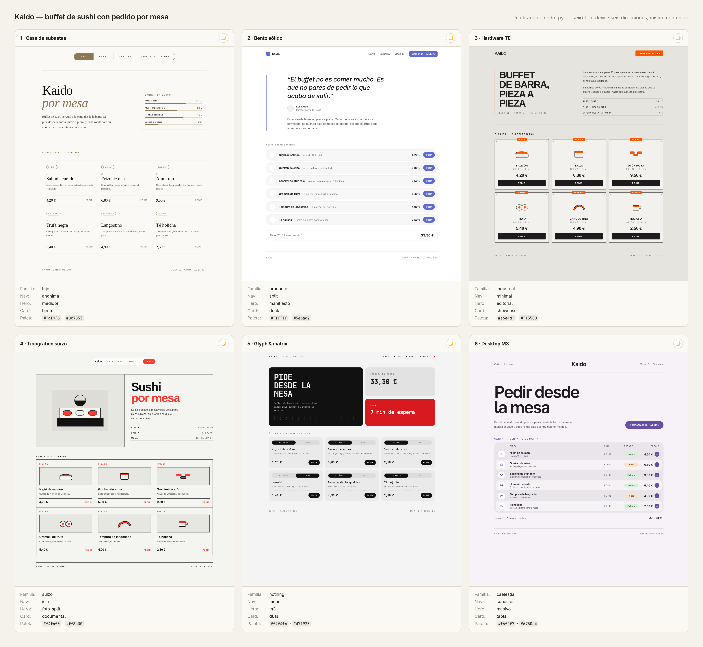

# ai-prototypes

Seis prototipos visuales de una misma página que **de verdad no se parecen entre sí**.

El problema que resuelve: si le pides a un modelo "tres opciones de diseño", te
devuelve tres veces la mediana de su entrenamiento (una clara y minimalista, una
oscura de lujo, una de papel). Aquí la dirección estética **no la elige el modelo**:
la tira un dado, `dado.py`, con un catálogo de 12 familias (caelestia, nothing,
liquid-glass, neumorphism, glassmorphism, industrial, claymorphism, producto, suizo,
editorial, lujo, orgánico) cruzadas con 10 arquetipos de tarjeta, 10 de navegación y 12
de cabecera. Cada prototipo sale con familia, `Nav`, `Hero` y `Card` distintos, así que la
diferencia no está solo en el color.

El dado recuerda las últimas tiradas y no las repite, así que no te sale siempre lo
mismo. La skill obliga después a montar una página que compare los seis a la vez
y a mirarla antes de entregar.

*Una tirada real (`--semilla demo`) para un buffet de sushi con pedido por mesa: `lujo` +
`medidor` + `bento`, `producto` + `manifiesto` + `dock`, `industrial` + `editorial` +
`showcase`, `suizo` + `foto-split` + `documental`, `nothing` + `m3` + `dual`, `caelestia` +
`masivo` + `tabla`. Los mismos seis platos y la misma comanda de 33,30 € en las seis, y
ninguna se parece a otra.*

## Instalar

**Antigravity CLI**

    git clone https://github.com/iaguito22/ai-prototypes ~/.gemini/config/skills/prototypes

**Claude Code**

    git clone https://github.com/iaguito22/ai-prototypes ~/.claude/skills/prototypes

Necesita `python3` para el dado. Nada más.

## Usar

    /prototypes necesito una web para un bufet de sushi donde se pida por mesa

Se activa también sola cuando pides "varias versiones", "opciones de diseño" o
arrancas un diseño sin dirección estética decidida.

Banderas del dado (las usa el modelo, pero puedes lanzarlo a mano):

    python3 dado.py --semilla <texto>   repite exactamente la misma tirada
    python3 dado.py --evitar lujo       descarta una familia entera
    python3 dado.py --solo suizo        fuerza una y sortea las otras cinco
    python3 dado.py --repetir           ignora la memoria de tiradas recientes

## Ver el resultado

El último paso pide **mirar** la comparativa antes de entregarla. Si tienes
[`agy-ver`](https://github.com/iaguito22/a-gemini-more-like-claude) vale `agy-ver abrir
comparar.html`; si no, sirve cualquier forma de ver la página de verdad.

## Licencia

MIT.
