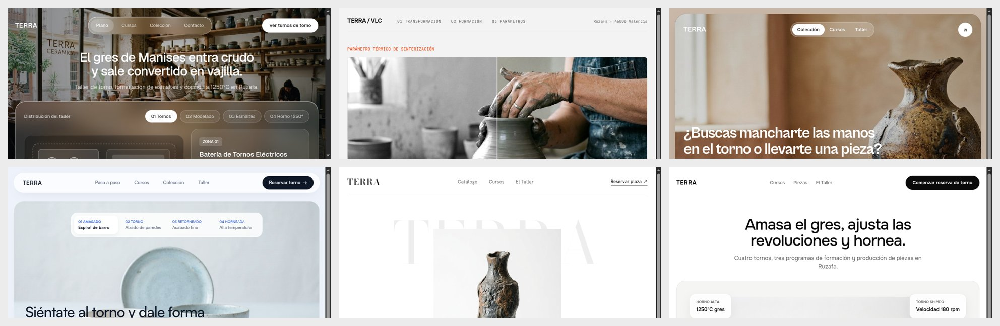

# ai-prototypes

Seis prototipos visuales de una misma página que **de verdad no se parecen entre sí**.

El problema que resuelve: si le pides a un modelo "varias opciones de diseño", te devuelve
seis pieles del mismo esqueleto (mismo titular, mismas secciones, solo cambian color y
fuente) o cae en los delatores de IA: hero mitad texto / mitad foto, la palabra clave del
titular en otro color, una fila de cifras, brillos de colores.

Aquí la dirección no la elige el modelo: la tira un dado, `dado.py`, sacado de shots reales
de Dribbble (Kumo, Golfair, Nuvé, Liquid Brokers, MarkOne, Fineo…). Cada prototipo recibe:

- un **estilo** de 8 (suave, minimal, liquid-glass, nothing, lienzo, estudio, editorial,
  suizo), siempre clean, una sola tinta;
- un **hero** de 7, ninguno partido: foto a sangre con widgets de vidrio, objeto enorme
  centrado, objeto en órbita, retrato anotado con UI, palabra gigante recortada…; en cada
  tirada uno lleva **foto a pantalla completa**;
- un **concepto, estructura y voz** propios, para que sean seis ideas y no seis colores;
- **su propia foto**: en estas referencias la imagen es la página y el concepto va encima.

Detecta si el encargo es una landing, una app móvil o un panel, guarda memoria de las
últimas tiradas para no repetirlas, y la skill obliga a montar una página que compare los
seis a la vez y a mirarla antes de entregar.

*Seis primeras pantallas para un taller de cerámica: liquid-glass con foto a sangre, suizo
en retícula, lienzo con la pregunta encima de la foto, suave con barra de pasos, editorial
con palabra gigante y minimal con el titular centrado. Mismos datos del negocio en las seis.*

## Instalar

**Antigravity CLI**

    git clone https://github.com/iaguito22/ai-prototypes ~/.gemini/config/skills/prototypes

**Claude Code**

    git clone https://github.com/iaguito22/ai-prototypes ~/.claude/skills/prototypes

**Windows** (PowerShell) — la carpeta es la misma, solo cambia la ruta:

    git clone https://github.com/iaguito22/ai-prototypes $env:USERPROFILE\.gemini\config\skills\prototypes
    git clone https://github.com/iaguito22/ai-prototypes $env:USERPROFILE\.claude\skills\prototypes

Necesita Python para el dado, y nada más. En Windows el intérprete se llama `python`
(o `py -3`), no `python3`.

## Usar

    /prototypes necesito una web para una tienda de auriculares hi-fi

Se activa también sola cuando pides "varias versiones", "opciones de diseño" o
arrancas un diseño sin dirección estética decidida.

Banderas del dado (las usa el modelo, pero puedes lanzarlo a mano):

    python3 dado.py "taller de cerámica"      seis direcciones para ese encargo
                                              (en Windows: python dado.py "...")
    python3 dado.py --tipo movil "..."        fuerza landing, movil o panel
    python3 dado.py --listar                  lista los estilos
    python3 dado.py --evitar nothing,estudio  descarta estilos
    python3 dado.py --solo suizo              fuerza uno en P1 y sortea el resto
    python3 dado.py --semilla <texto>         repite exactamente la misma tirada
    python3 dado.py --repetir                 ignora la memoria de tiradas recientes

## Ver el resultado

El último paso pide **mirar** la comparativa antes de entregarla. Si tienes
[`agy-ver`](https://github.com/iaguito22/a-gemini-more-like-claude) vale `agy-ver abrir
comparar.html`; si no, sirve cualquier forma de ver la página de verdad.

## Licencia

MIT.
